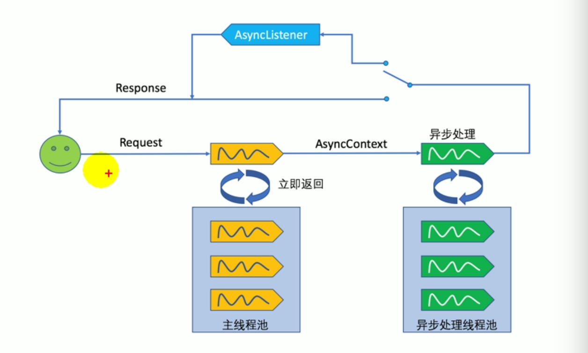

# Servlet3.0 注解

servlet3必须是tomcat7以上。


Servlet三大作用域


JSP作为Servlet的一种形式，JSP九大内置对象及四个作用域。


## 一、Servlet注解

Servlet三大组件：`Servlet`、`Filter`、`Listener`。以下注解必须被 Servlet 3.0 兼容的容器支持。

### 1、@WebServlet

注解用于Web应用中定义`Servlet`组件。必须指定注解的 `urlPatterns `或` value `属性。所有其他属性是可选的默认设置。

**注意：**

- `@WebServlet `注解的类必须继承` javax.servlet.http.HttpServlet` 类。

- 如果没有指定 `Servlet` 名字则默认是全限定类名

- 不能在注解上同时使用 `value `和 `urlPatterns` 属性

  

#### 一般方式实现

（1）`HelloServlet`继承`HttpServlet`

```java
public class HelloServlet extends HttpServlet {
    ......  
}
```

（2）web.xml中配置servlet映射

```xml
<servlet>
    <servlet-name>HelloServlet</servlet-name>
    <servlet-class>zxh.HelloServlet</servlet-class>
</servlet>
<servlet-mapping>
    <servlet-name>HelloServlet</servlet-name>
    <url-pattern>/hello</url-pattern>
</servlet-mapping>
```


#### 注解实现方式

1. `HelloServlet`继承`HttpServlet`
2. `@WebServlet`指定`value`映射地址或者使用`urlPatterns`配置多个映射地址

```java
//@WebServlet("/hello")
@WebServlet(name = "myservlet",urlPatterns = {"/hello","/hello1"})
public class HelloServlet extends HttpServlet {

    @Override
    protected void doGet(HttpServletRequest req, HttpServletResponse resp) throws ServletException, IOException {
       resp.getWriter().write("hello servlet");
    }
}
```


### 2、@WebFilter

该注解用于在 Web 应用中定义` Filter`。注解的 `urlPatterns `属性,` servletNames `属性 或 `value` 属性必须被指定。所有其他属性是可选的默认设置。

注意：

- `@ WebFilter` 注解的类必须实现 `javax.servlet.Filter`
- 如果没有指定`Filter` 名字则默认是全限定类名
- 同一注解上不能同时使用 `value` 和 `urlPatterns` 属性


#### 一般实现方式

（1）`HelloFilter`实现`Filter`接口

```java
public class HelloFilter implements Filter {

	@Override
	public void destroy() {
		System.out.println("HelloFilter>>>destroy()");

	}

	@Override
	public void doFilter(ServletRequest arg0, ServletResponse arg1, FilterChain arg2)
			throws IOException, ServletException {
		System.out.println("HelloFilter>>>doFilter()");
		arg2.doFilter(arg0, arg1);
	}

	@Override
	public void init(FilterConfig arg0) throws ServletException {
		System.out.println("HelloFilter>>>init()");
	}

}
```

（2）web.xml中配置filter映射

```xml
 <filter>
     <filter-name>helloFilter</filter-name>
     <filter-class>zxh.HelloFilter</filter-class>
</filter>
<filter-mapping>
    <filter-name>helloFilter</filter-name>
    <url-pattern>/hello</url-pattern>
</filter-mapping>
```


#### 注解实现方式

（1）`HelloFilter`实现`Filter`接口

（2）`@WebFilter`指定`value`映射地址或者使用`urlPatterns`配置多个映射地址

```java
@WebFilter(filterName = "helloFilter",value = "/hello")
public class HelloFilter implements Filter {
    /**
     * 初始化时执行
     * @param filterConfig
     * @throws ServletException
     */
    @Override
    public void init(FilterConfig filterConfig) throws ServletException {
        System.out.println("HelloFilter>>>init");
    }

    /**
     * 过滤器链
     * @param servletRequest
     * @param servletResponse
     * @param filterChain
     * @throws IOException
     * @throws ServletException
     */
    @Override
    public void doFilter(ServletRequest servletRequest, ServletResponse servletResponse, FilterChain filterChain) throws IOException, ServletException {
        System.out.println("HelloFilter>>>doFilter");
        //传递下一个filter
        filterChain.doFilter(servletRequest,servletResponse);
    }

    /**
     * 销毁时执行
     */
    @Override
    public void destroy() {
        System.out.println("HelloFilter>>>destroy");
    }
}

```


### 3、@WebListener

`WebListener` 注解用于注解用来获得特定 web 应用上下文中的各种操作事件的监听器。

@WebListener 注解的类必须实现以下接口：

- `javax.servlet.ServletContextListener`：监听Servlet容器启动和销毁

- `javax.servlet.ServletContextAttributeListener`：用于监听ServletContext（application）范围内属性的变化 

- `javax.servlet.ServletRequestListener`：用于监听request对象的创建和销毁

- `javax.servlet.ServletRequestAttributeListener`：用于监听request属性变化

- `javax.servlet.http.HttpSessionListener`：用于监听session的创建和销毁

- `javax.servlet.http.HttpSessionAttributeListener`：用于监听seesion属性变化

- `javax.servlet.http.HttpSessionIdListener`：监听session Id

  


#### 一般实现方式

（1）编写监听器`MyServletContextListener` 实现监听接口`ServletContextListener`。根据实际监听的需求去实现对应的监听接口

```java
public class MyServletContextListener implements ServletContextListener{

    //Servlet 容器终止Web应用时调用
	public void contextDestroyed(ServletContextEvent sce) {
	}

    //当Servlet 容器启动Web 应用时调用
	public void contextInitialized(ServletContextEvent sce) {
			
	}

}
```

（2）web.xml中注册监听器

```xml
<listener>
    <listener-class>zxh.MyServletContextListener</listener-class>
</listener>
```


#### 注解实现方式

##### 1、ServletContextListener：监听servlet容器启动和销毁

```java
@WebListener
public class MyServletContextListener implements ServletContextListener {

    /**
     * 当Servlet 容器启动Web 应用时调用该方法。在调用完该方法之后，容器再对Filter 初始化，
     *  并且对那些在Web应用启动时就需要被初始化的Servlet 进行初始化。
     * @param servletContextEvent
     */
    @Override
    public void contextInitialized(ServletContextEvent servletContextEvent) {
        //获取ServletContext对象
        ServletContext servletContext = servletContextEvent.getServletContext();
        //添加servlet
        ServletRegistration.Dynamic userServlet = servletContext.addServlet("userServlet1", UserServlet.class);
        //servlet映射
        userServlet.addMapping("/user");
        
        //可以添加filter 和listener...
        System.out.println("MyServletContextListener>>>contextInitialized()");

    }

    /**
     * 当Servlet 容器终止Web 应用时调用该方法。在调用该方法之前，容器会先销毁所有的Servlet 和Filter 过滤器。
     * @param servletContextEvent
     */
    @Override
    public void contextDestroyed(ServletContextEvent servletContextEvent) {
        System.out.println("MyServletContextListener>>>contextDestroyed()");
    }
}

```

- `contextInitialized`：当Servlet 容器启动Web 应用时调用该方法
- `contextDestroyed：`当Servlet 容器终止Web 应用时调用该方法


##### 2、ServletContextAttributeListener：监听ServletContext（application）范围内属性的变化 

```java
@WebListener
public class MyServletContextAttributeListener implements ServletContextAttributeListener {

    /**
     * 当程序把一个属性存入application范围时触发该方法
     * @param scev
     */
    @Override
    public void attributeAdded(ServletContextAttributeEvent scev) {
        print(scev,"application范围内的属性：【添加】>>>>");
    }

    /**
     * 当程序把一个属性从application范围删除时触发该方法
     * @param scev
     */
    @Override
    public void attributeRemoved(ServletContextAttributeEvent scev) {
        print(scev,"application范围内的属性：【删除】>>>>");
    }

    /**
     * 当程序替换application范围内的属性时将触发该方法。
     * @param scev
     */
    @Override
    public void attributeReplaced(ServletContextAttributeEvent scev) {
        print(scev,"application范围内的属性：【修改】>>>>");

        Object value_ = scev.getServletContext().getAttribute(scev.getName());
        System.out.println("修改后的值为："+value_);
    }

    private void print(ServletContextAttributeEvent servletContextAttributeEvent,String msg){
        String name = servletContextAttributeEvent.getName();
        Object value = servletContextAttributeEvent.getValue();
        System.out.println(msg+":[name="+name+",value="+value+"]");
    }
}
```

方法说明：

- `attributeAdded(ServletContextAttributeEvent scev) `：当程序把一个属性存入application范围时触发该方法

- `attributeRemoved(ServletContextAttributeEvent scev)`：当程序把一个属性从application范围删除时触发该方法
- `attributeReplaced(ServletContextAttributeEvent scev)`：当程序替换application范围内的属性时将触发该方法


index.jsp操作属性值：

```jsp
<%@ page contentType="text/html;charset=UTF-8" language="java" %>
<%
  System.out.println("添加userName>>>>>>>>");
  application.setAttribute("userName", "张三");

  System.out.println("修改userName>>>>>>>>");
  application.setAttribute("userName","李四");

  System.out.println("删除userName>>>>>>>>");
  application.removeAttribute("userName");

  application.setAttribute("userName1","李四1");

  ServletContext servletContext = pageContext.getServletContext();
  servletContext.setAttribute("address","guangzhou");

%>
<html>
  <head>
    <title>$Title$</title>
  </head>
  <body>
hello
  </body>
</html>
```


`application`和`ServletContext`操作属性值都会被监听。


`application`和`ServletContext`由什么区别？

**相同点：**

其实`servletContext`和`application `是一样的，就相当于一个类创建了两个不同名称的变量；

在 ` servlet`中`ServletContext`就是`application`对象。打开jsp编译过后生成的`Servlet`中的`_jspService()`方法就可以看到如下的声明：

```java
ServletContextapplication = null;

application= pageContext.getServletContext();
```

**不同点：**

两者的区别就是`application`用在jsp中，`servletContext`用在servlet中。`application`和`page  `、`requestsession `都是JSP中的内置对象；`ServletContext`可以用`pageContext`获得

```jsp
 ServletContext servletContext = pageContext.getServletContext();
```


参考文章：

[ServletContext 与application的异同](https://blog.csdn.net/lxhjh/article/details/80842411)


##### 3、ServletRequestListener：监听Request创建和销毁

```java
/**
 * 对request对象进行监听
 */
@WebListener
public class MyServletRequestListener implements ServletRequestListener {
    /**
     * request对象销毁时调用
     * @param srv
     */
    @Override
    public void requestDestroyed(ServletRequestEvent srv) {
        System.out.println("MyServletRequestListener>>>requestDestroyed()"+Thread.currentThread().getName());
    }

    /**
     * request对象创建时调用
     * @param srv
     */
    @Override
    public void requestInitialized(ServletRequestEvent srv) {
        System.out.println("MyServletRequestListener>>>requestInitialized()=="+Thread.currentThread().getName());
        //获取ServletContext
        ServletContext servletContext = srv.getServletContext();

        //获取ServletRequest
        ServletRequest servletRequest = srv.getServletRequest();


        System.out.println( "remoteAddr="+servletRequest.getServerName()+" remoteHost="+servletRequest.getServerPort());
        Enumeration<String>  paramters = servletRequest.getParameterNames();

        System.out.println("请求参数：");
        while(paramters.hasMoreElements()){
            String param = paramters.nextElement();
            String value = servletRequest.getParameter(param);
            System.out.print("["+param+"="+value+"] ");
        }

    }
}

```


方法说明：

- `requestInitialized(ServletRequestEvent srv)`：request对象销毁时调用
- `requestInitialized(ServletRequestEvent srv)`： request对象创建时调用


**访问HTML页面是否创建请求对象 ：会**

**访问JSP页面是否创建请求对象 ：会**

**访问Servlet是否创建请求对象 ：会**


 发起一个请求：curl http://localhost:8080/hello?namn=df

打印日志：

```text
MyServletRequestListener!requestInitialized()>>>request对象创建:http-nio-8080-exec-6
remoteAddr=localhost remoteHost=8080
请求参数：
[namn=df] HelloFilter>>>doFilter

MyServletRequestListener!requestDestroyed()>>>request对象销毁:http-nio-8080-exec-6
```


##### 4、ServletRequestAttributeListener：监听request属性变化

```java
@WebListener
public class MyServletRequestAttributeListener implements ServletRequestAttributeListener {
    /**
     *  属性添加时调用
     * @param srae
     */
    @Override
    public void attributeAdded(ServletRequestAttributeEvent srae) {
        System.out.println("MyServletRequestAttributeListener!attributeAdded>>>添加属性："+srae.getName());
    }

    /**
     * 属性删除时调用
     * @param srae
     */
    @Override
    public void attributeRemoved(ServletRequestAttributeEvent srae) {
        System.out.println("MyServletRequestAttributeListener!attributeRemoved>>>删除属性："+srae.getName());
    }

    /**
     * 属性修改时调用
     * @param srae
     */
    @Override
    public void attributeReplaced(ServletRequestAttributeEvent srae) {
        System.out.println("MyServletRequestAttributeListener!attributeReplaced>>>修改属性："+srae.getName());
    }
```

方法说明：

- `attributeAdded(ServletRequestAttributeEvent srae)`：属性添加时调用
- `attributeRemoved(ServletRequestAttributeEvent srae)`：属性删除时调用
- `attributeReplaced(ServletRequestAttributeEvent srae)`：属性修改时调用


##### 5、HttpSessionListener：监听session创建和销毁

```java
@WebListener
public class MyHttpSessionListener implements HttpSessionListener {
    @Override
    public void sessionCreated(HttpSessionEvent httpSessionEvent) {
        System.out.println("MyHttpSessionListener!sessionCreated>>>session创建:"+httpSessionEvent.getSession().getId());
    }

    @Override
    public void sessionDestroyed(HttpSessionEvent httpSessionEvent) {
        System.out.println("MyHttpSessionListener!sessionDestroyed>>>session销毁:"+httpSessionEvent.getSession().getId());
    }
}

```

方法说明：

- `sessionCreated(HttpSessionEvent httpSessionEvent)`：session创建时调用
- `sessionDestroyed(HttpSessionEvent httpSessionEvent)`：session销毁时调用


**访问HTML是否创建Session ：不会**

**访问JSP是否创建Session ：会**

**访问Servlet是否创建Session ：不会（默认没有调用getSession方法）**


项目启动时创建session，调用sessionCreate方法。当执行`session.invalidate();`销毁session时调用sessionDestoryed方法


##### 6、HttpSessionAttributeListener：监听session属性值

```java
@WebListener
public class MyHttpSessionAttributeListener implements HttpSessionAttributeListener {
    @Override
    public void attributeAdded(HttpSessionBindingEvent httpSessionBindingEvent) {
        System.out.println("MyHttpSessionAttributeListener!attributeAdded>> 添加session属性值："+httpSessionBindingEvent.getName());
    }

    @Override
    public void attributeRemoved(HttpSessionBindingEvent httpSessionBindingEvent) {
        System.out.println("MyHttpSessionAttributeListener!attributeRemoved>> 删除session属性值："+httpSessionBindingEvent.getName());
    }

    @Override
    public void attributeReplaced(HttpSessionBindingEvent httpSessionBindingEvent) {
        System.out.println("MyHttpSessionAttributeListener!attributeReplaced>> 修改session属性值："+httpSessionBindingEvent.getName());
    }
}
```

方法说明：

- `attributeAdded(HttpSessionBindingEvent httpSessionBindingEvent)`：session属性值添加时调用
- `attributeRemoved(HttpSessionBindingEvent httpSessionBindingEvent)`：session属性值删除时调用
- `attributeReplaced(HttpSessionBindingEvent httpSessionBindingEvent)`：session属性值修改时调用


### 4、@WebInitParam

该注解用于指定必须传输到`Servlet`或`Filter`的任何初始化参数。它是`WebServlet`和`WebFilter`注解的一个属性注解。

如何用web.xml配置方式如下：

```xml
 
<servlet>
    <servlet-name>HelloServlet</servlet-name>
    <servlet-class>zxh.HelloServlet</servlet-class>
   <!--设置初始化参数 -->  
    <init-param>  
        <param-name>name</param-name>  
        <param-value>zxh</param-value>  
    </init-param> 
</servlet>
<servlet-mapping>
    <servlet-name>HelloServlet</servlet-name>
    <url-pattern>/hello</url-pattern>
</servlet-mapping>
  
```


Servlet 使用注解方式：

```java
@WebServlet(name = "myservlet",urlPatterns = {"/hello"},
        initParams = {
                @WebInitParam(name = "name",value = "james"),
                @WebInitParam(name = "age",value = "20")
        }

)
public class HelloServlet extends HttpServlet {

    @Override
    protected void doGet(HttpServletRequest req, HttpServletResponse resp) throws ServletException, IOException {
        ServletConfig config = getServletConfig();
        String name = config.getInitParameter("name");
        String age = config.getInitParameter("age");
        System.out.println("name="+name+" age="+age);
    }
}
```

- `initParams`里面可以包含多个`@WebInitParam`
- 通过`ServletConfig`的`getInitParamter`获取值


Filter使用注解方式：

```java
@WebFilter(filterName = "helloFilter",value = "/hello",
    initParams = {
        @WebInitParam(name="filter",value = "HelloFilter")
    }
)
public class HelloFilter implements Filter {
    @Override
    public void init(FilterConfig filterConfig) throws ServletException {
        String filtername =  filterConfig.getInitParameter("filter");
        System.out.println("filtername="+filtername);
       
    }

}

```

- `initParams`里面可以包含多个`@WebInitParam`
- 通过`FilterConfig`的`getInitParamter`获取值


### 5、@MultipartConfig

该注解用于Servlet上传时配置

```java
@Target({ElementType.TYPE})
@Retention(RetentionPolicy.RUNTIME)
public @interface MultipartConfig {
    String location() default "";

    long maxFileSize() default -1L;

    long maxRequestSize() default -1L;

    int fileSizeThreshold() default 0;
}
```

指定上传路径，最大大小等设置。


## 二、共享库 **/**  运行时可插拔性

> 容器在启动应用的时候，会扫描当前应用每一个jar包里面
> META-INF/services/javax.servlet.ServletContainerInitializer
> 指定的实现类，启动并运行这个实现类的方法；传入感兴趣的类型；


x

1. 创建`META-INF/services/javax.servlet.ServletContainerInitializer`
   	文件，内容就是自定义的`ServletContainerInitializer`实现类的全类名；


2. 编写MyServletContainerInitializer，实现ServletContainerInitializer接口

```java
//容器启动时会将@HandlesTypes指定类型下的子类（实现类、子接口等）传递过来
@HandlesTypes(value = {HelloService.class})
public class MyServletContainerInitializer implements ServletContainerInitializer
{
    /**
     * 应用启动时运行onStartup方法
     * @param set 指定类型的所有子类型集合
     * @param servletContext web容器
     * @throws ServletException
     */
    @Override
    public void onStartup(Set<Class<?>> set, ServletContext servletContext) throws ServletException {
        System.out.println("ServletContainerInitializer onstarup >>>>>>>> start ");
        //获取要扫描的类
        for (Class c: set
             ) {
            System.out.println(c.toString());
        }

        System.out.println("ServletContainerInitializer onstarup >>>>>>>> end ");

    }
}

```

注意：

- 实现ServletContainerInitializer接口

- @HandlesTypes指定要扫描的类(指定类型下的子类（实现类、子接口等）传递过来)

- 也可以在onStartup方法中注册Servet、Filter、Listener

  ```java
   @Override
      public void onStartup(Set<Class<?>> set, ServletContext servletContext) throws ServletException {
          System.out.println("\n使用ServletContext注册Web组件(Servlet、Filter、Listener)");
  
          //添加servlet
          ServletRegistration.Dynamic userServlet = servletContext.addServlet("userServlet",UserServlet.class);
          //servlet映射
          userServlet.addMapping("/user");
  
  
          //注册listener
          servletContext.addListener(UserListener.class);
  
          //注册Filter
          FilterRegistration.Dynamic userFilter = servletContext.addFilter("userFilter",UserFilter.class);
          //配置filter映射(所有请求)
          userFilter.addMappingForUrlPatterns(EnumSet.of(DispatcherType.REQUEST),true,"/");
      }
  ```

  

## 总结

**ServletContext注册三大组件**

使用ServletContext注册Web组件(Servlet、Filter、Listener)

使用编码的方式，必须在项目启动时给ServletContext里面添加组件。有以下两种方式：

1. ServletContainerInitializer得到的ServletContext；
2. ServletContextListener得到的ServletContext；


## 三、异步Servlet

Servlet3.0之后提供了异步Servlet。

### 异步Servlet有什么作用？

在服务器的并发请求数量比较大的时候,会产生很多的servlet线程(这些servlet线程在servlet容器的线程池中维护)；

如果每个请求需要耗费的时间比较长(比如,执行了一些IO的处理等),在之前的非异步的servlet中,这些servlet线程将会阻塞,严重耗费服务器的资源。

而异步servlet,通过一个单独的新的线程来执行这些比较耗时的任务(也可以把这些任务放到一个自己维护的线程池里),servlet主线程立即释放。servlet池以便响应其他请求,这样,在降低了系统的资源消耗的同时,也会提升系统的吞吐量




### 异步上下文对象

实现了 AsyncContext 接口的对象可从 ServletRequest 的一个 startAsync 方法中获得，一旦有了 AsyncContext对象,就能够使用它的 complete()方法来完成请求处理,或转发。

```java
@WebServlet(value = "/async",asyncSupported = true)//1、支持异步处理asyncSupported=true
public class HelloAsynServlet extends HttpServlet {

    @Override
    protected void doGet(HttpServletRequest req, HttpServletResponse resp) throws ServletException, IOException {

        System.out.println("主线程开始：[Thread-"+Thread.currentThread().getId()+"] 时间："+System.currentTimeMillis());

        //2、开启异步模式 主要是req.startAsync();
        //AsyncContext asyncContext = req.getAsyncContext();
        AsyncContext asyncContext =req.startAsync();

        //3、业务逻辑进行异步处理;开始异步处理
        asyncContext.start(() ->{
            System.out.println("副线程开始：[Thread-"+Thread.currentThread().getId()+"] 时间："+System.currentTimeMillis());
            try {
                sayHello();

                //4、完成请求处理
                asyncContext.complete();

                resp.getWriter().write(" hello HelloAsynServlet ");

            } catch (Exception e) {
                e.printStackTrace();
            }


            System.out.println("副线程结束：[Thread-"+Thread.currentThread().getId()+"] 时间："+System.currentTimeMillis());
        });
        System.out.println("主线程结束：[Thread-"+Thread.currentThread().getId()+"] 时间："+System.currentTimeMillis());

    }


    private void sayHello() throws InterruptedException {
        System.out.println(Thread.currentThread()+" processing...");
        TimeUnit.SECONDS.sleep(3);
    }
}

```

1. asyncSupported=true：开启支持异步处理

2. req.startAsync()：开启异步模式

3. asyncContext.complete()：完成请求处理

结果：
```text
主线程开始：[Thread-30] 时间：1555216548690
主线程结束：[Thread-30] 时间：1555216548695
副线程开始：[Thread-31] 时间：1555216548695
Thread[http-nio-8080-exec-6,5,main] processing...
副线程结束：[Thread-31] 时间：1555216551699
```